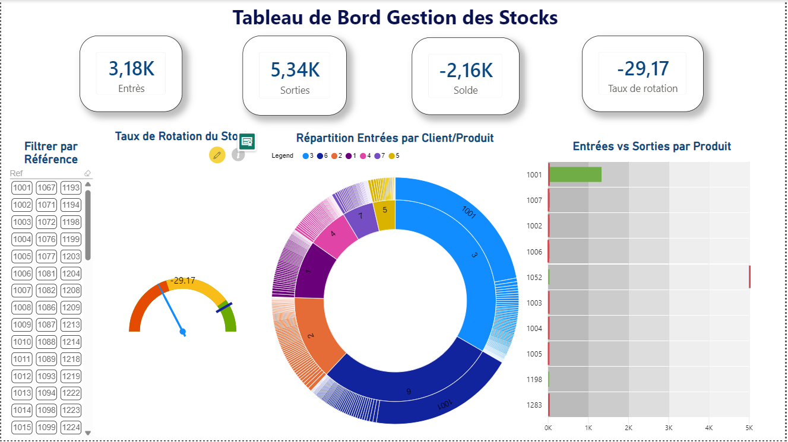

# 📦 Tableau de Bord — Gestion des Stocks

## 📋 Description
Dashboard Power BI proactif pour l'analyse
et le suivi en temps réel de la gestion
des stocks d'un entrepôt.

## 🎯 Objectifs
1. Analyser les entrées par Produit/Famille/Région
2. Analyser les sorties par Produit/Famille/Région
3. Analyser les soldes pour chaque produit
4. Analyser le stock moyen trimestriel
5. Analyser le solde moyen par famille
6. Analyser le taux de rotation du stock

## 📊 Dashboard

## 📈 Indicateurs Calculés

| Indicateur | Description | Formule |
|------------|-------------|---------|
| Entrées | Total quantités reçues | SUMX FILTER Sens=E |
| Sorties | Total quantités sorties | SUMX FILTER Sens=S |
| Solde | Stock disponible | Entrées - Sorties |
| Solde_trim | Stock moyen trimestriel | Solde/nb mois |
| Solde_famille | Solde par famille | Solde/nb refs |
| Total Ventes | Total ventes | SUMX FILTER Code=3 |
| Taux rotation | Vitesse rotation | Ventes/Solde_trim |
| MVT/Client | Mouvements par client | SUMX RELATEDTABLE |

## 🎨 Visuels Avancés Utilisés

| Visual | Source | Usage |
|--------|--------|-------|
| Bullet Chart | OKViz | Entrées vs Sorties par Produit |
| Sunburst Chart | Microsoft | Hiérarchie Client/Produit |
| Tornado Chart | Custom | Comparaison Entrées/Sorties |
| Advanced Gauge | xViz | Taux de Rotation |
| Chiclet Slicer | Custom | Filtrage par Référence |
| KPI Cards | Built-in | Indicateurs clés |
| Line Chart | Built-in | Evolution mensuelle |

## 🔍 Conclusions Clés
- Solde négatif: sorties supérieures aux entrées
- Taux de rotation négatif: problème stock
- Produit 1001 domine les entrées
- Client 3 est le plus actif

## 🛠️ Technologies
- Power BI Desktop
- DAX (Data Analysis Expressions)
- Power Query M
- Custom Visuals AppSource

## 📁 Structure du Projet

BI-Gestion-Stock/
├── PROJET_POWER_BI_2.pbix
├── Data/
│ ├── Mvt.xlsx
│ ├── Client.xlsx
│ ├── Inventaire.xlsx
│ └── T_date.xlsx
├── Screenshots/
│ └── dashboard_stock.png
├── DAX/
│ └── measures_stock.md
└── README.md

## 🚀 Comment ouvrir
1. Installer Power BI Desktop (gratuit sur Microsoft Store)
2. Télécharger PROJET_POWER_BI_2.pbix
3. Ouvrir avec Power BI Desktop
4. Interagir avec les slicers et visuels

## 👤 Auteur
**Yassir Bouchnaf**
Étudiant en BUISINESS AND DATA MANAGEMENT, ESITH Casablanca
